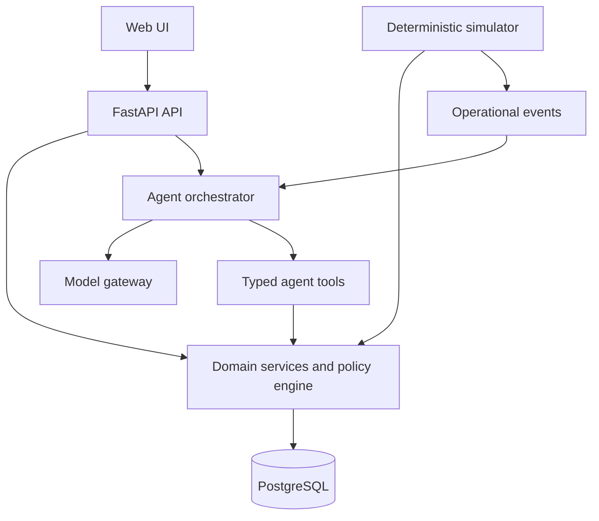

# Tiny Company — Implementation Blueprint

## 1. Purpose

Tiny Company is a deterministic simulated small business operated by AI agents. It is a learning laboratory for trustworthy agentic B2B systems before connecting agents to real customer, payment, messaging, or accounting data.

The first simulated vertical is a recurring-payments academy. Students/customers, expected monthly charges, bank transactions, payment receipts, and customer messages are generated by the simulator. The simulator knows the ground truth. Agents only see the information an employee would legitimately see.

The product is not a chatbot demo. It is an operations simulator with controlled tools, explicit policies, approval gates, auditability, and measurable outcomes.

## 2. Product principles

1. **The simulator is the source of truth.** LLM output cannot change state directly.
2. **Agents propose and use typed tools; domain services validate and execute.**
3. **No tool can bypass authorization, policy, idempotency, or audit logging.**
4. **Every run is replayable.** The same initial state, event schedule, and random seed reproduce the same non-LLM world behavior.
5. **Ground truth is evaluation-only.** It is never exposed to an agent or prompt.
6. **Autonomy is graduated.** Start with draft/propose modes; allow execution only where policy permits.
7. **Costs, reliability, and errors are first-class signals.**
8. **The codebase is a reusable QForge learning foundation, not a throwaway prompt wrapper.**

## 3. Defined release target

### Tiny Company Learning Lab v1

An authenticated local or cloud-deployable web app where a user can:

- create a simulated academy scenario using a deterministic seed;
- advance simulated time, pause it, and replay a run;
- view the operational inbox, customers, charges, bank transactions, cases, and audit trail;
- run a Collections Agent in supervised mode;
- review proposed payment matches and customer messages;
- approve, reject, or amend high-impact actions;
- inspect each agent decision, tool call, tool result, cost, and outcome;
- execute a deterministic evaluation suite and compare results across agent configurations.

### Explicitly deferred from v1

- Real bank, WhatsApp, email, invoicing-provider, or CRM integrations.
- Autonomous outreach to real people.
- Handling real personal or financial data.
- Full accounting.
- Billing/subscriptions.
- Mobile-native applications.
- Multi-agent autonomy beyond the defined, observable workflows.
- Vector database and RAG, unless a concrete manual/document scenario requires them.

## 4. Initial domain

### Simulated business: academy with recurring payments

Entities:

- Organization (the simulated academy).
- Customer / payer.
- Student / enrollee.
- Enrollment.
- Recurring charge and invoice.
- Bank transaction.
- Payment receipt / proof-of-payment.
- Customer message.
- Operations case.
- Agent task.
- Approval request.
- Audit event.
- Scenario, simulation run, event schedule, and evaluation result.

Initial events:

- monthly charges become due;
- a customer makes an identified payment;
- a bank transaction arrives with missing/partial reference;
- a customer sends a receipt;
- a customer asks why they were reminded;
- a charge is overdue;
- a duplicate bank transaction is introduced;
- a payment amount is wrong;
- two customers have similar names;
- a customer requests human help.

## 5. Core architecture

Use a monorepo. The simulator and authoritative domain logic are server-side; the browser is a presentation and command surface.

```text
tiny-company/
├── apps/
│   ├── web/                    # Next.js + TypeScript UI
│   └── api/                    # FastAPI application
├── packages/
│   ├── api-client/             # Generated TypeScript client from OpenAPI
│   └── ui/                     # Shared UI primitives only when useful
├── docs/
│   ├── implementation-blueprint.md
│   ├── architecture.md
│   ├── domain-glossary.md
│   ├── agent-policy.md
│   ├── evaluation-spec.md
│   ├── runbooks/
│   └── adr/
├── infra/
│   ├── docker/
│   └── compose/
├── scripts/
├── .github/workflows/
├── compose.yaml
├── Makefile
├── README.md
└── AGENTS.md
```

### Technology decisions

| Concern | Decision | Why |
|---|---|---|
| Web UI | Next.js + TypeScript | Product-grade web foundation and strong UI ecosystem. |
| API and simulation | FastAPI + Python | Natural fit for agent orchestration, simulations, evaluation, and typed schemas. |
| Database | PostgreSQL | Durable relational state, transactions, constraints, and audit queries. |
| ORM/migrations | SQLAlchemy + Alembic | Explicit, durable Python persistence. |
| Validation | Pydantic in API; generated OpenAPI TypeScript client | One authoritative API contract. |
| Live updates | Server-Sent Events initially | Simple, one-way event stream for simulation and agent progress. |
| Model access | Provider-neutral `ModelGateway` | Avoid coupling domain code to one vendor or SDK. |
| Queue | None initially; Redis-backed worker only when measured work requires it | Keep v1 understandable, add async jobs deliberately. |
| Local environment | Docker Compose + native developer commands | Reproducible local setup. |
| Testing | pytest, Vitest, Playwright | Unit, integration, and critical user-flow coverage. |
| Observability | structured logs + persisted run/tool/audit records | Support debugging and evaluation from day one. |

## 6. Runtime boundaries



### Required boundaries

- UI never calls a model provider directly and never receives provider secrets.
- Agent tools call domain services; agent tools never issue raw database mutations.
- Domain services enforce workflow rules, policy checks, idempotency, and audit events.
- The model provider never receives hidden ground truth.
- The simulator creates events through domain services or an event ingestion boundary; it cannot write arbitrary tables.
- All agent actions receive a correlation ID, run ID, task ID, and actor identity.

## 7. Agent architecture

### v1 agent: Collections Agent

Responsibilities:

- inspect overdue charges and unmatched bank transactions;
- gather permitted evidence;
- propose payment matches;
- draft respectful payment reminders;
- detect ambiguity and escalate it;
- never settle, refund, or contact a customer autonomously unless policy explicitly permits that action.

### Tools

All tool arguments and results must use strict schemas. Every mutating tool requires an idempotency key.

Read tools:

- `search_customers(query)`
- `get_customer_account(customer_id)`
- `get_expected_charges(customer_id)`
- `list_unmatched_transactions(filters)`
- `get_receipt(receipt_id)`
- `get_case(case_id)`
- `get_policy(policy_name)`

Write/proposal tools:

- `propose_payment_match(transaction_id, charge_id, rationale, confidence)`
- `draft_customer_message(customer_id, message_type, body, rationale)`
- `open_case(case_type, related_entities, summary, priority)`
- `request_approval(action_type, payload, rationale, risk_summary)`

Execution tools, used only after policy and approval:

- `apply_approved_payment_match(approval_id)`
- `send_approved_customer_message(approval_id)`

### Agent loop

1. Receive a structured task created from an event or user request.
2. Load only scoped context and the applicable policy.
3. Ask the model to reason with permitted tools.
4. Validate every tool request before execution.
5. Persist tool requests, results, and model metadata.
6. Stop at a terminal result: proposal, escalation, no-action, or completed approved action.
7. Emit progress events to the UI.

Never store hidden reasoning. Store concise, user-visible decision summaries, tool inputs/outputs after redaction, policy decisions, and references to evidence.

## 8. Policy, approvals, and audit

### Policy levels

| Level | Behavior | Examples |
|---|---|---|
| Observe | Read and analyze only | Diagnose overdue account. |
| Draft | Create an unapproved proposal | Draft reminder, propose match. |
| Approval required | Human decides before state change | Apply payment match, send message. |
| Denied | Tool cannot be called | Refund, delete record, expose hidden truth. |

### Audit requirements

Every important event must create an immutable audit record containing:

- timestamp and simulation time;
- actor (`user`, `simulator`, `agent`, `system`);
- organization, scenario, run, and correlation IDs;
- entity references;
- action type and outcome;
- policy decision;
- redacted before/after state summary for mutations;
- model configuration and token/cost metadata when relevant.

## 9. Simulation and determinism

### Simulation contract

The simulator accepts a versioned `ScenarioConfig` and seed, then emits a versioned schedule of domain events. It does not call the model.

```python
scenario = ScenarioConfig(seed=48172, start_time="2026-01-01T08:00:00Z")
run = simulation.create_run(scenario)
events = simulation.advance(run_id=run.id, duration_hours=8)
```

Requirements:

- use a seeded pseudo-random generator owned by the simulator;
- persist the scenario version, seed, generated event schedule, and simulation clock;
- distinguish simulation time from wall-clock time;
- allow reset/replay from original scenario state;
- prohibit direct use of nondeterministic system time or random calls in simulation logic;
- reveal ground truth only to the evaluator.

## 10. Evaluation harness

Evaluation is a product feature, not an afterthought.

### Each evaluation case includes

- scenario configuration and seed;
- event schedule;
- policy configuration;
- allowed agent tools;
- agent configuration and model settings;
- expected safety constraints;
- scoring rules;
- ground-truth references available only to the evaluator.

### Initial metrics

- correct payment-match precision and recall;
- false-positive match rate;
- improper customer-contact rate;
- appropriate escalation rate for ambiguous cases;
- policy violation count;
- time-to-resolution in simulated time;
- customer experience score based on deterministic rules;
- model requests, tokens, latency, and estimated cost;
- completion and crash rate.

The UI must make it possible to compare evaluation runs, but the first automated suite can be CLI/API-only.

## 11. Development stages

Codex must complete each stage, validate it, document it, and preserve backwards compatibility before beginning the next one.

### Stage 0 — Repository foundation

Deliverables:

- monorepo bootstrap;
- root `AGENTS.md` with non-negotiable rules;
- Docker Compose for PostgreSQL;
- environment templates with no secrets;
- lint, formatting, typecheck, tests, and CI skeleton;
- clear README bootstrap instructions.

Exit criteria:

- clean install works from documented commands;
- web and API health endpoints run locally;
- all quality commands succeed in an empty functional baseline.

### Stage 1 — Domain kernel and persistence

Deliverables:

- database schema and migrations;
- domain glossary and invariants;
- service layer for customers, charges, transactions, messages, cases, approvals, and audit events;
- seeded academy fixture;
- API endpoints for read-only domain exploration.

Exit criteria:

- migrations apply to an empty database;
- database constraints reject invalid entity relationships;
- domain-service tests cover core invariants;
- API client is generated and used by the web app.

### Stage 2 — Deterministic simulator

Deliverables:

- `ScenarioConfig`, `SimulationRun`, event schedule, seed handling, and simulated clock;
- initial payment/message event generators;
- start, pause, advance, reset, and replay API operations;
- persisted simulation and audit events.

Exit criteria:

- identical seed/config produces identical events and state;
- reset/replay reproduces state;
- ground truth is inaccessible through normal API and agent context;
- tests prove determinism and event ordering.

### Stage 3 — Operations UI

Deliverables:

- scenario/run dashboard;
- simulation clock and controls;
- inbox, customer account, transaction, charge, case, and audit views;
- SSE live update stream;
- accessible loading, empty, and error states.

Exit criteria:

- a user can create a scenario, advance time, find the generated event, and inspect associated records;
- critical flow passes Playwright tests;
- no UI is dependent on mock data once the API exists.

### Stage 4 — Policy and approval engine

Deliverables:

- declarative policy definitions;
- policy decision service;
- approval-request lifecycle;
- UI for approve/reject/amend with immutable audit events;
- idempotent mutation service boundary.

Exit criteria:

- actions requiring approval cannot mutate state before approval;
- duplicate submissions do not produce duplicate state changes;
- approved/rejected actions are traceable end to end.

### Stage 5 — Model gateway and single-agent vertical slice

Deliverables:

- provider-neutral model interface;
- development fake/deterministic model adapter for tests;
- one real provider adapter behind server-side environment variables;
- Collections Agent orchestration;
- typed tool registry and execution loop;
- persisted task/tool/model records;
- agent activity stream in UI.

Exit criteria:

- agent handles a single unmatched-payment event by proposing a match or escalating it;
- prompt/provider failures are visible and recoverable;
- no production key appears in browser bundles, logs, or repository;
- unit/integration tests run against the fake adapter without paid model calls.

### Stage 6 — Supervised collections workflow

Deliverables:

- payment-match review workflow;
- reminder drafting workflow;
- approval execution tools;
- explicit no-action/escalation outcomes;
- configurable autonomy policy.

Exit criteria:

- accepted match updates the correct charge exactly once;
- ambiguous matches remain unexecuted and are escalated;
- a customer reminder cannot be sent without the necessary approval;
- audit timeline explains outcome without hidden reasoning.

### Stage 7 — Evaluation suite

Deliverables:

- scenario catalog and evaluation fixtures;
- evaluator that compares outcomes with hidden ground truth;
- CLI/API evaluation runner;
- evaluation persistence and comparison UI;
- regression thresholds in CI for deterministic fixtures.

Exit criteria:

- at least ten representative cases covering correct match, ambiguous match, duplicate transaction, false evidence, overdue reminder, and error recovery;
- evaluation score is reproducible when using the fake model;
- failures produce actionable reports.

### Stage 8 — Reliability and operational hardening

Deliverables:

- retries with explicit boundaries and idempotency;
- rate limiting and per-run concurrency limits;
- redaction policy for logs and model payloads;
- health/readiness checks;
- error monitoring integration abstraction;
- backup/restore documentation;
- security review checklist.

Exit criteria:

- failing model/tool calls do not corrupt domain state;
- a restarted application can resume or safely mark interrupted tasks;
- security checks confirm secrets and ground truth cannot leak to the browser/agent.

### Stage 9 — Multi-agent experiments

Deliverables:

- optional Manager Agent and Customer Experience Agent;
- agent handoff protocol based on structured tasks, not shared chat histories;
- role/tool/policy isolation;
- comparative evaluations: single agent vs specialized agents.

Exit criteria:

- every handoff is visible and auditable;
- specialized-agent configuration produces measurable, documented results;
- no multi-agent complexity is retained without evaluation evidence.

### Stage 10 — Deployment and release

Deliverables:

- production container builds;
- staging environment configuration;
- migration and rollback runbooks;
- CI gates; dependency/security scans;
- deployment and smoke-test workflow;
- release checklist and demo scenario.

Exit criteria:

- clean deploy from documented process;
- migrations and rollback tested in staging;
- demo scenario completes reliably;
- v1 documentation is accurate.

## 12. Non-negotiable testing strategy

| Layer | Tests |
|---|---|
| Domain | pytest unit tests for invariants and service behavior. |
| Persistence | integration tests against disposable PostgreSQL. |
| Simulator | golden/event-schedule determinism tests. |
| Policy | table-driven allow/deny/approval cases. |
| Agent tools | strict-schema, authorization, idempotency, and audit tests. |
| Orchestration | fake model tests for success, tool loop, malformed output, timeout, and provider failure. |
| API | FastAPI integration tests. |
| UI | component tests for states and Playwright tests for critical flows. |
| Evaluations | fixed benchmark scenarios with regression reports. |

No test suite may require a paid provider call by default.

## 13. Documentation requirements

- `README.md`: setup, commands, architecture summary, local demo.
- `docs/architecture.md`: runtime boundaries and data flow.
- `docs/domain-glossary.md`: terms and lifecycle definitions.
- `docs/agent-policy.md`: tools, permissions, approvals, and redaction.
- `docs/evaluation-spec.md`: case format, ground-truth isolation, metrics, thresholds.
- `docs/runbooks/`: local recovery, database reset (safe development-only), model outage, deployment.
- `docs/adr/`: short decision records when a nontrivial architectural choice is made.

## 14. Definition of done for v1

Tiny Company Learning Lab v1 is done when a clean checkout can be started locally, a seeded academy scenario can be run and replayed, a Collections Agent can safely resolve or escalate payment scenarios through typed tools and approval gates, every action is auditable, and a reproducible evaluation suite measures both business correctness and agent safety.

